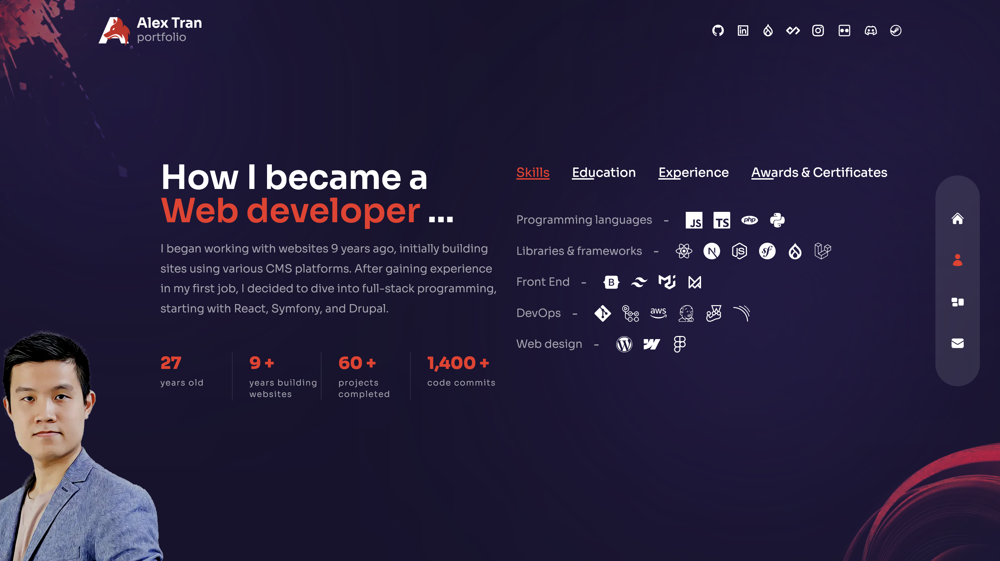
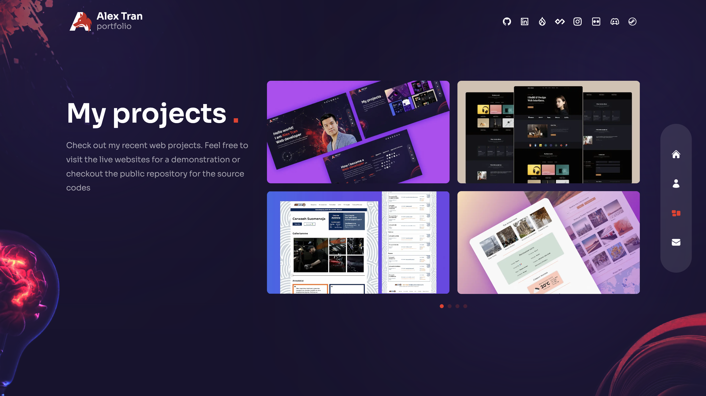
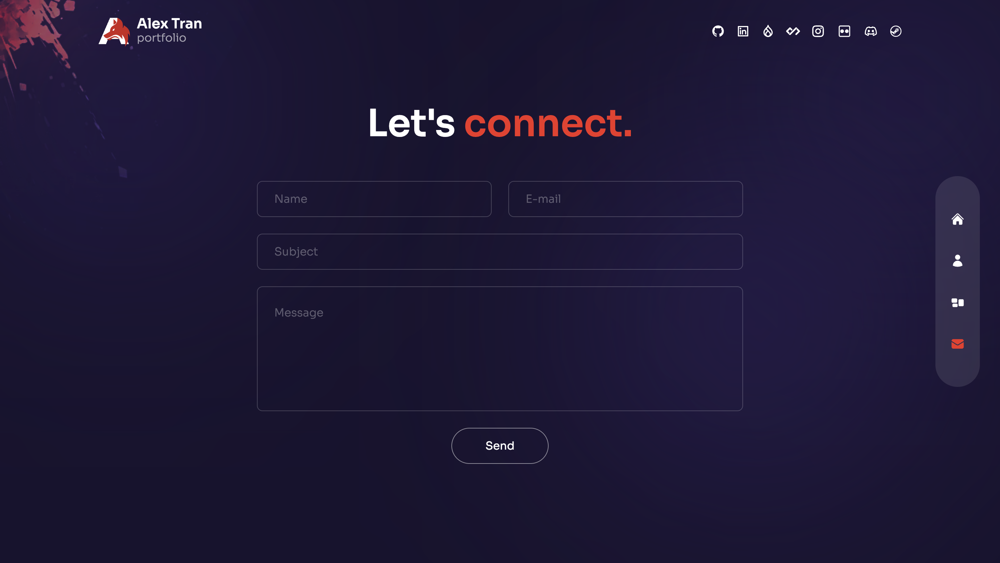
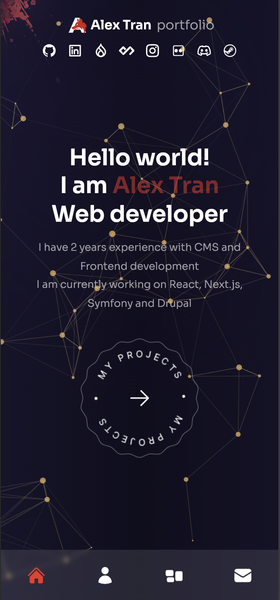
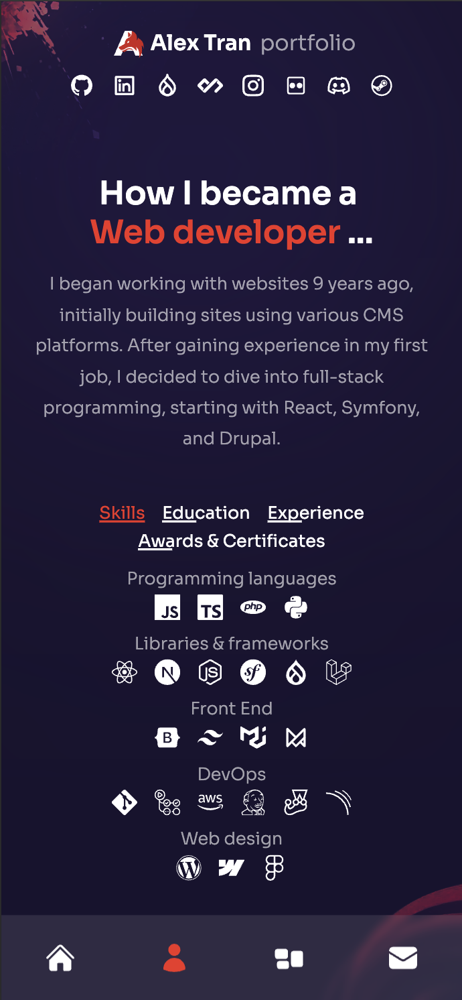
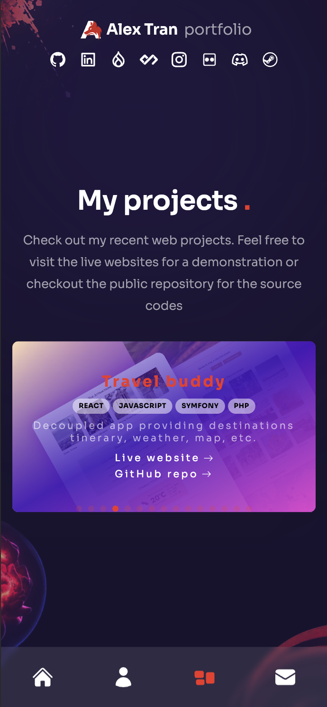

# Portfolio v3
This is the third version of my personal portfolio built with next.js, tailwind and framer motion

## Functions:
- Landing page with nice floating particle that user can interact
- About page with brief introduction text and multiple tab for different infos
- Projects page featuring all my past projects with description and links
- Contact page using Resend and an API endpoint to send contact message

## Technologies used
Languages:
- JavaScript

Libraries and frameworks:

- Next.Js
- TailwindCSS
- Framer Motion
- Resend
- React swiper
- TsParticles

## Setup and usage

**Live page [here](https://alextran.dev)**

**To host project locally**
- Clone the project: ```git clone https://github.com/alextrandev/portfolio_v3```
- Change working directory ```cd portfolio_v3```
- Install dependencies ```npm install```
- Serve project in local host ```npm run dev```

## Screenshot
**Homepage**


**About page**


**Projects page**


**Contact page**


**Mobile version**
<div>
  
  
  
</div>

## Authors and acknowledgment

- Frontend template from [Cristian Mihai](https://www.youtube.com/@cristianmihai01)
